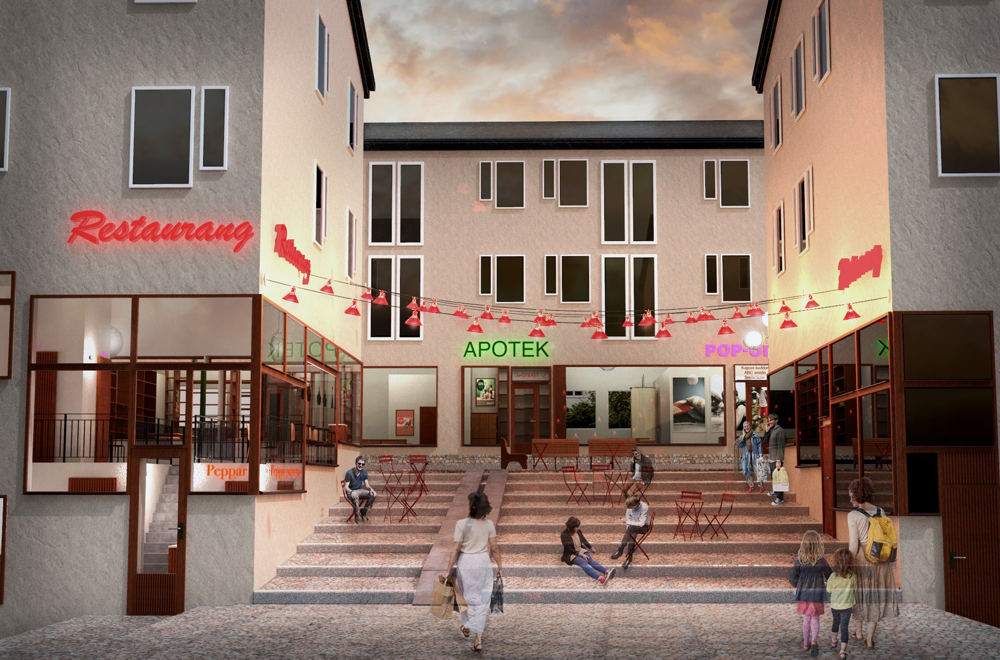
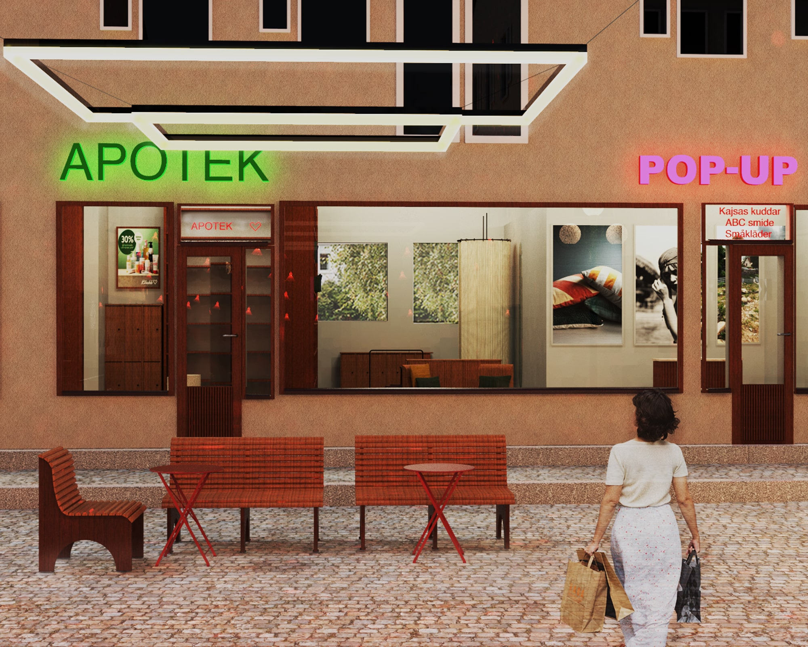
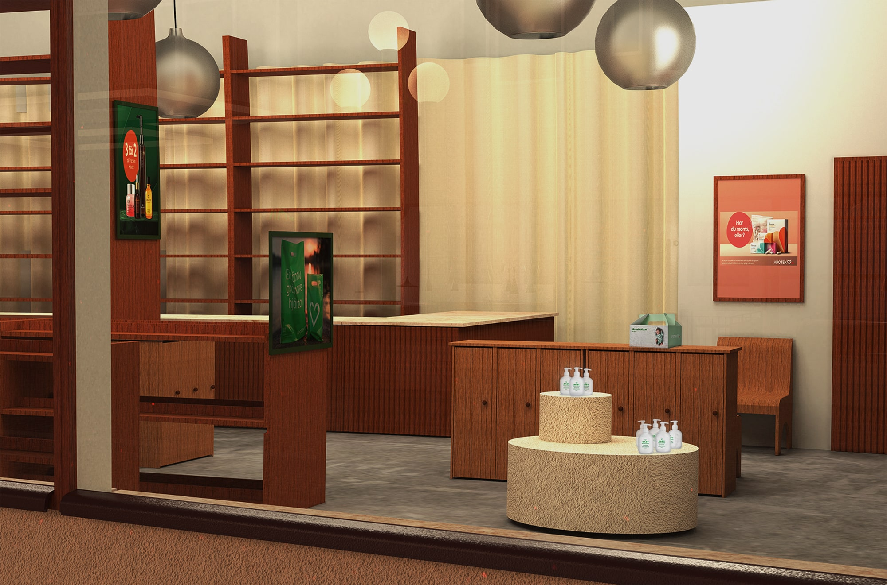
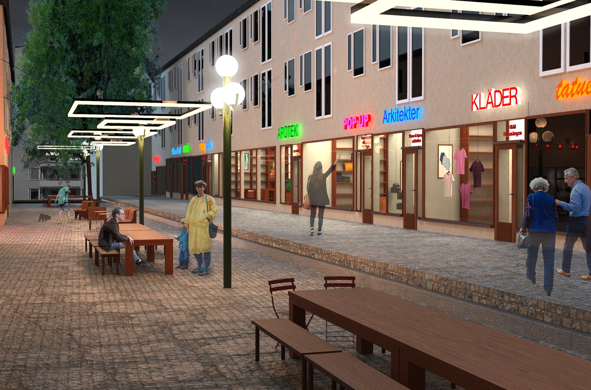
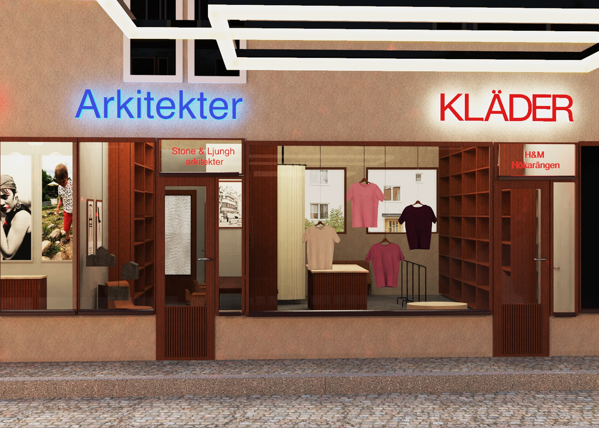
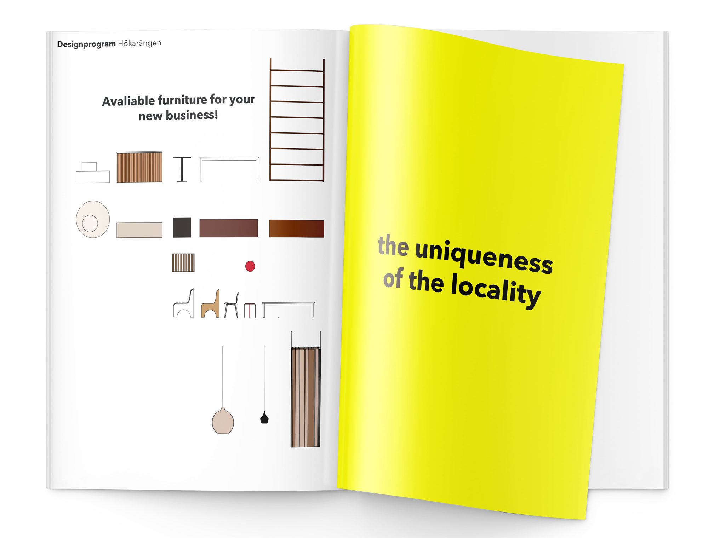
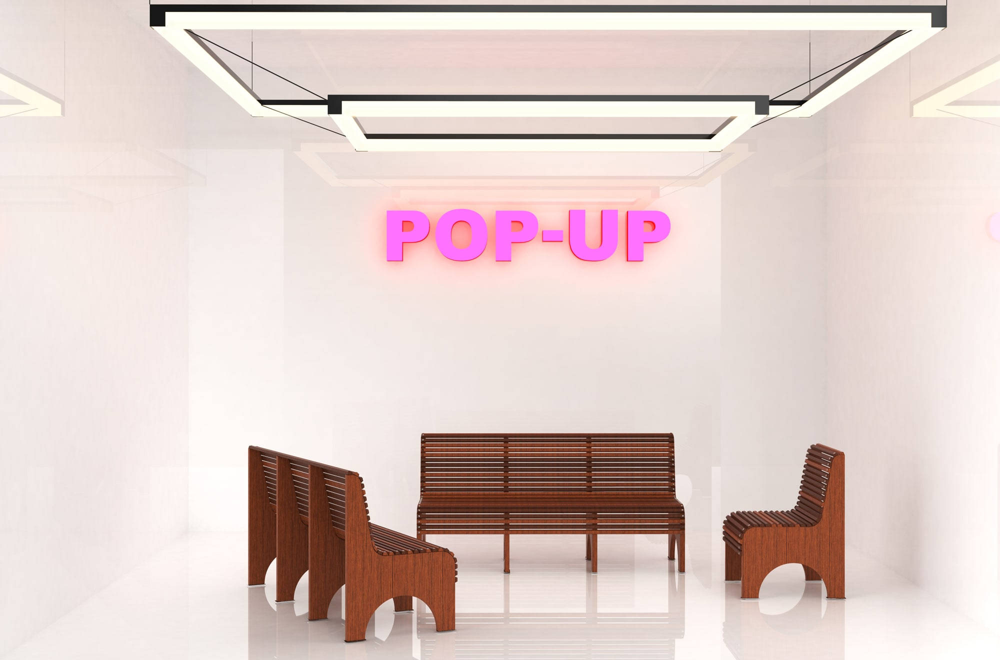
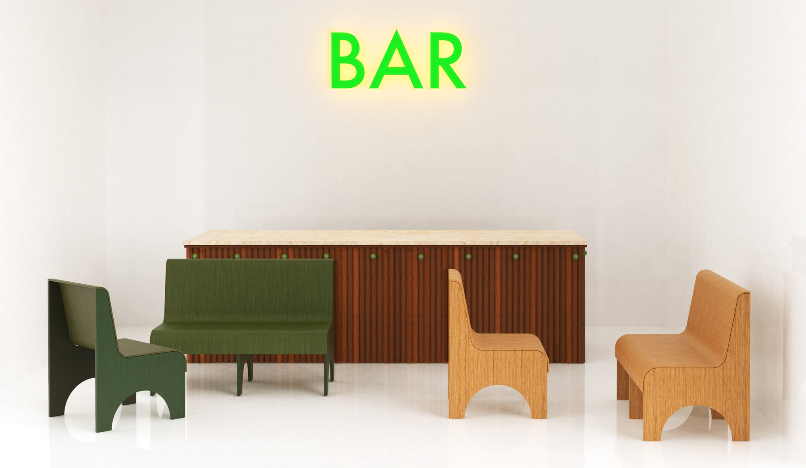

What’s going on in the commercial areas of the world, Sweden and Stockholm? In malls, main streets and suburban centers, many shop premises are abandoned.
 
If stores are constantly closing down in these areas, what remains?
 
I believe commercial spaces will still be important in the future, despite internet shopping and the climate crisis, as places we will visit to experience things, socialize and where business meets with their costumers physically. 

In my degree project I investigate how to approach ”the retail apocalypse” strategic as an interior architect. In a case study of one suburban centre facing these troubles, Hökarängens Centrum, my aim is to show how interior architecture and furniture design can lift the identity of a place through a design program specifik for that place. 
This in order to see our suburban centers as valuable local hubs, all of them unique, and that it is their uniqueness that will bring both businesses and Stockholmers back to our suburban centers.

