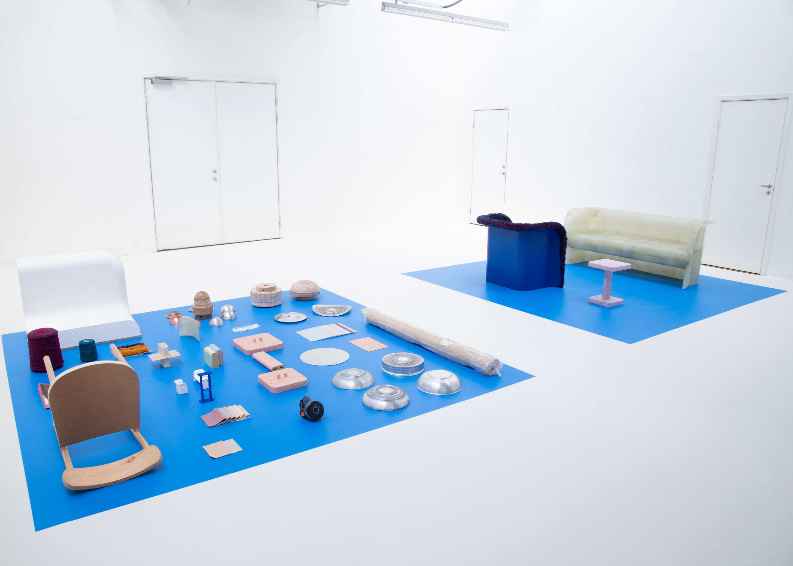
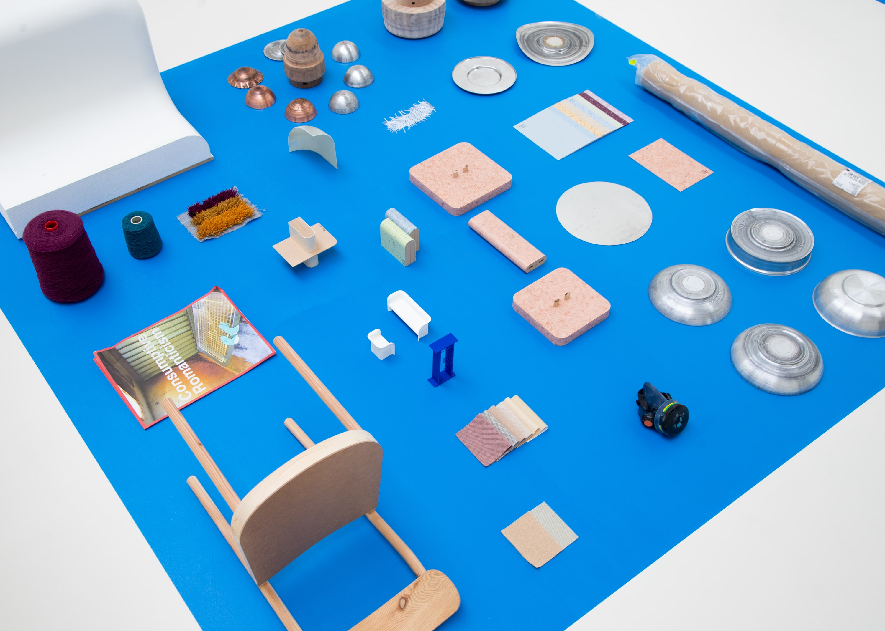
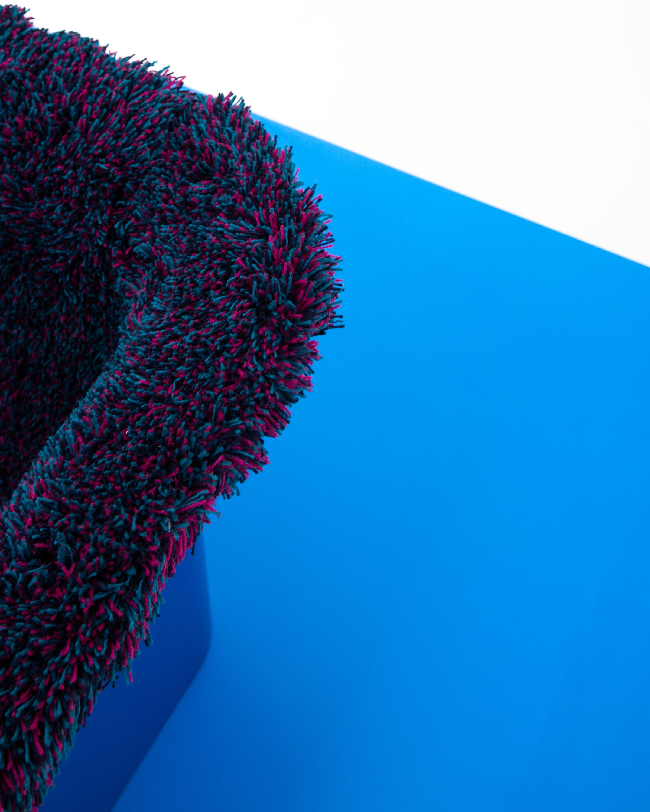
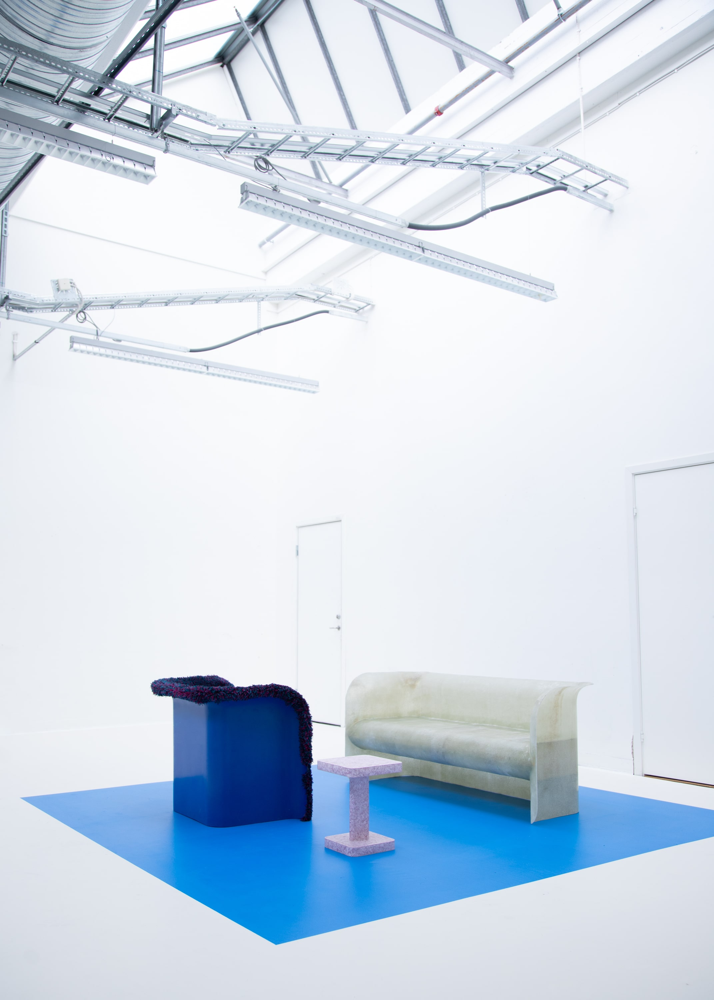

This thesis aims to contest the contradictive qualities that a chosen set of materials possess.

By applying aluminium, fibreglass, wool and vinyl to a set of production processes and product designs, I visually discuss the conscious and environmental responsibility designers have when utilising such materials in their own spatial practice.

The importance of highlighting the contradictory details that these materials carry can be attributed to the modern context of production. The ability to produce objects with an increasingly large physical disconnection between thinkers and makers allows a diluted sense of responsibility. The relationship between designer and producer can be seen as a dis-jointed discussion sometimes losing sight of the true impact some materials place on their environment.

By investigating Swedish modernist design history, modern environmental designers’ anxiety, factory tours and materials of opposite environmental and production impacts, I have produced a series of objects. These highlight the question of ‘conscious responsibility’ designers have when utilising such materials in their own practice of spatial design.

By exhibiting the juxtaposition between both material research and finalised designs, I allowed the audience to see the process behind how a material is used to produce a new product whilst highlighting the facts around each material’s contradictive elements.

   Photo: Andrew Watts")

   Photo: Andrew Watts")

