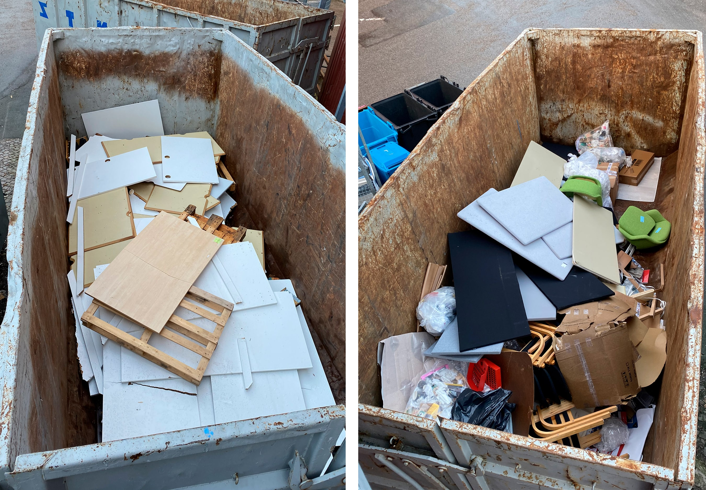
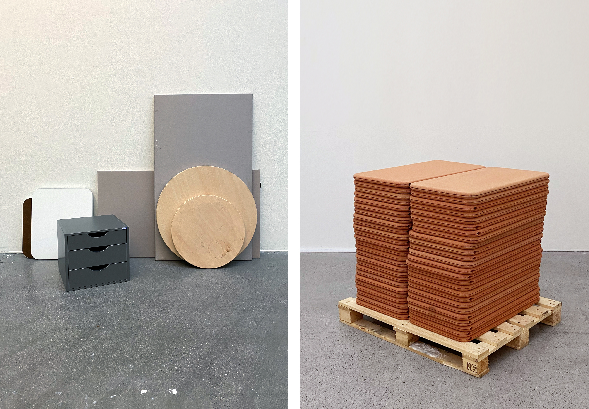
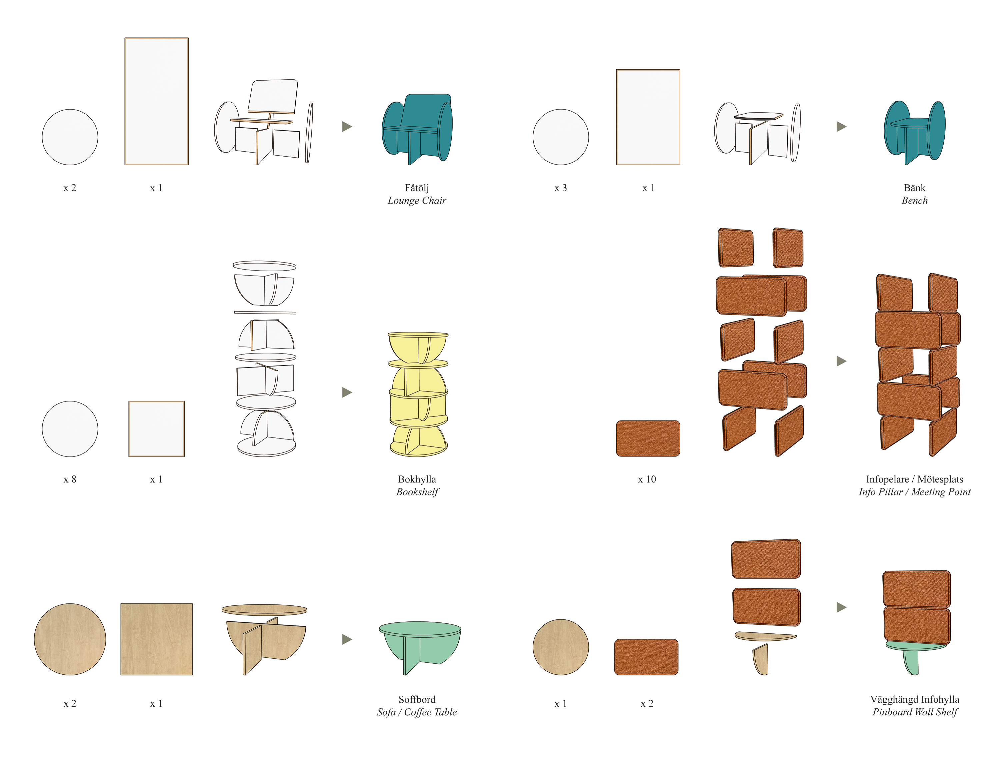
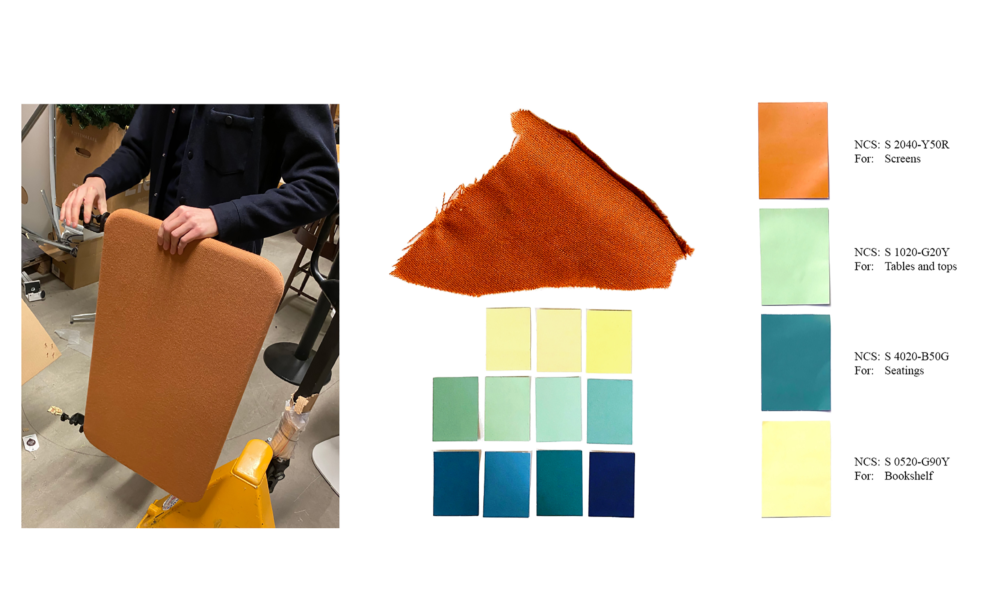

Today, more than ever, it’s absurd how much fine extracted and produced material is being wasted after its first lifecycle, instead of being put into new use, just because it’s cheaper and easier to buy and make new. This needs to fundamentally change says Daniel Svahn who with his MFA Degree Project argues for material reuse and upcycling as the new and future production, as opposed to constantly making new things out of new, extracted, material. 

In his work Svahn has focused on the material that is deemed as “waste”, from furniture, mostly from the public sector, that even the current reconditioning companies find hard to upcycle and give new life. Fine material that risk being binned and incinerated that still have much more to give material wise. 

Through his project and work he has collaborated with two professional reconditioning companies in Sweden; RP - Recycling Partner and Rekomo, and have had access to their supposed ”waste” material, to create new things from. 
As an aspiring interior architect and furniture designer, Svahn has explored what he can create with this material, what that would look like and how he can develop new ideas and different approaches, products and services that could help to form the new design paradigm and aesthetics for future circular and sustainable furniture and interior solutions. 

In this quest Svahn has designed and handmade six new, characteristic, functional and fresh objects out of the “old”. With small tweaks and means he has aimed to add a greater value to the material and to prolong the lifecycle of it indefinitely. 

Since the materials he has used almost exclusively came from the contract office market and public sector originally, Svahn also wanted his new furniture to land within that segment. New, interesting, and unique pieces for say an office or other public context. 
Another aspect to his work has been about that he have wanted his new designs to look “real”, like proper products, and not as obviously upcycled. 
With that, by experimenting with form, surfaces, and colour, he has transformed the old material into an ensemble of new objects and furniture that act as a sort of imaginarium - telling a story of what this kind of material can become instead of going to waste.

")

