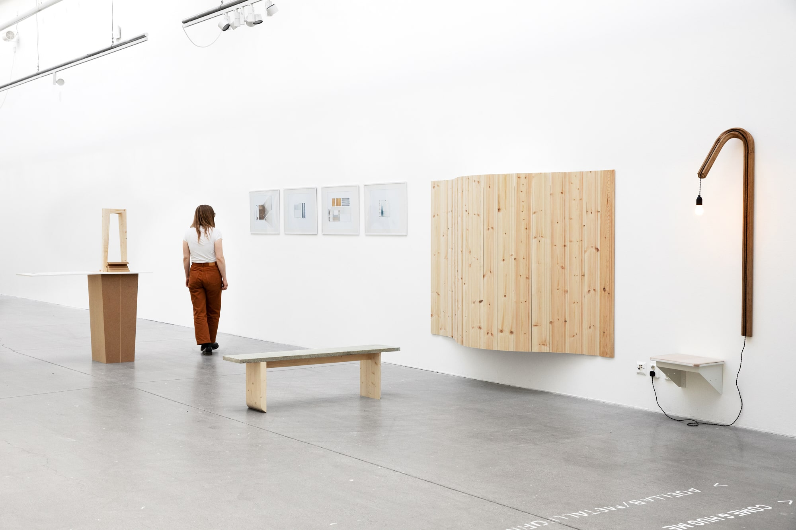
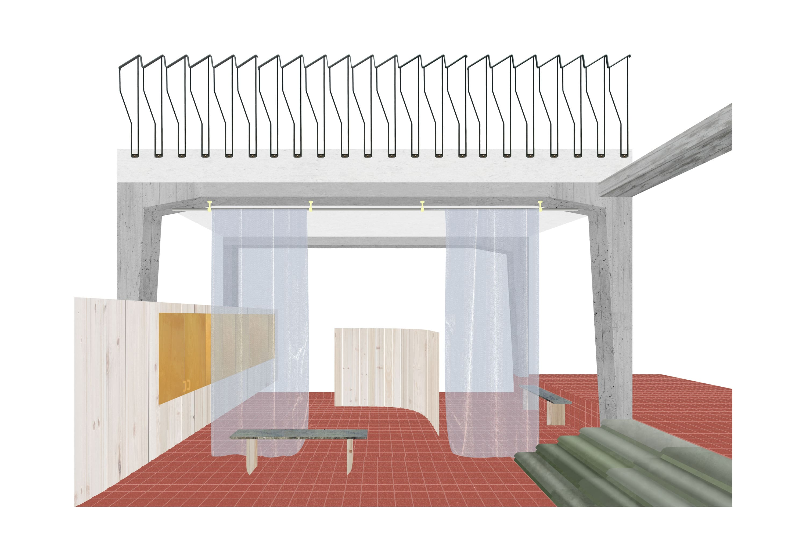
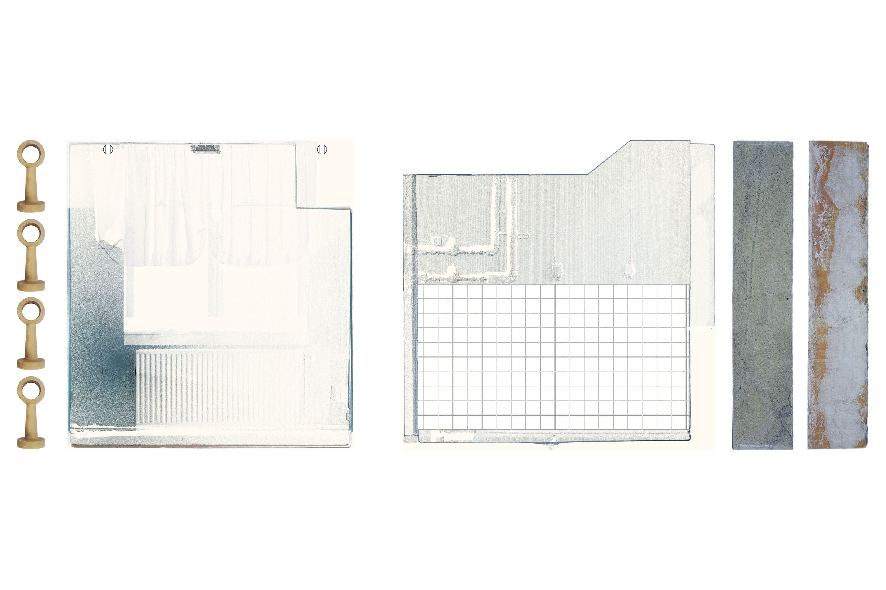
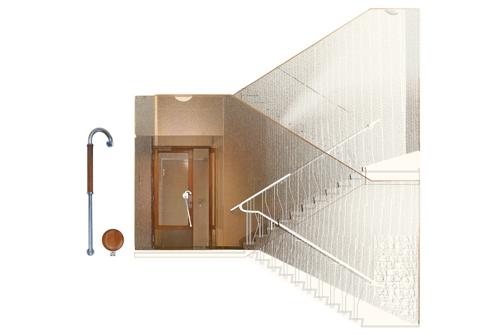
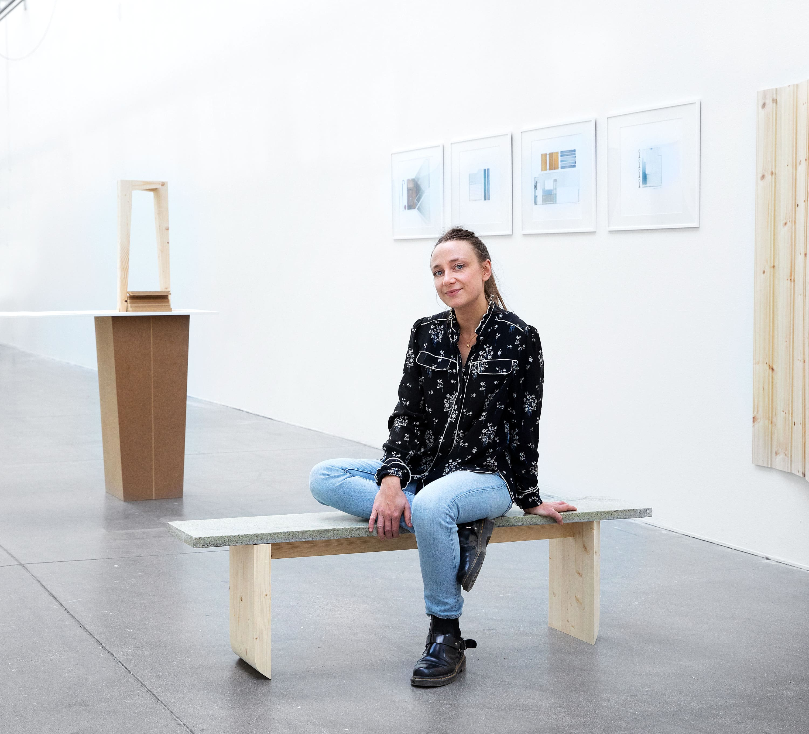

A project about reusing materials as a way to rethink how architecture can be produced. 

The meatpacking district of Stockholm is at the beginning of a period of change. A lot of its buildings are being demolished, or at least gutted, to transform a historical area of industry into a more urban district of housing, offices, trade, and services. This project is about one of these buildings, recently torn down to make room for the new subway station. Sandhagen 2 was built as a factory for charcuterie in the early 1950’s and had until its demolition been used for manufacturing sausages, hams, smoked pork and pâtées. 

Through documentation an inventory was made into a resource repository, the chosen limitation being to look specifically at interior and surface materials and to reuse them in a new spatial composition. Balustrade of carved wood, terracotta tiles, stone window ledges and concrete pillars. What will happen when these elements are removed from the stench of slaughter and carefully placed in a new context?

The aesthetic of reuse challenges the balanced and ordered in favour for variety and unexpected relationships between building elements and materials. This creates a new positive tension to the work of the architect. To use salvaged material requires a new design method that takes into account all the logic and history that comes along with that material. 

 of extracted elements from Sandhagen 2, model pieces   Photo: Elisa Hedin" )

