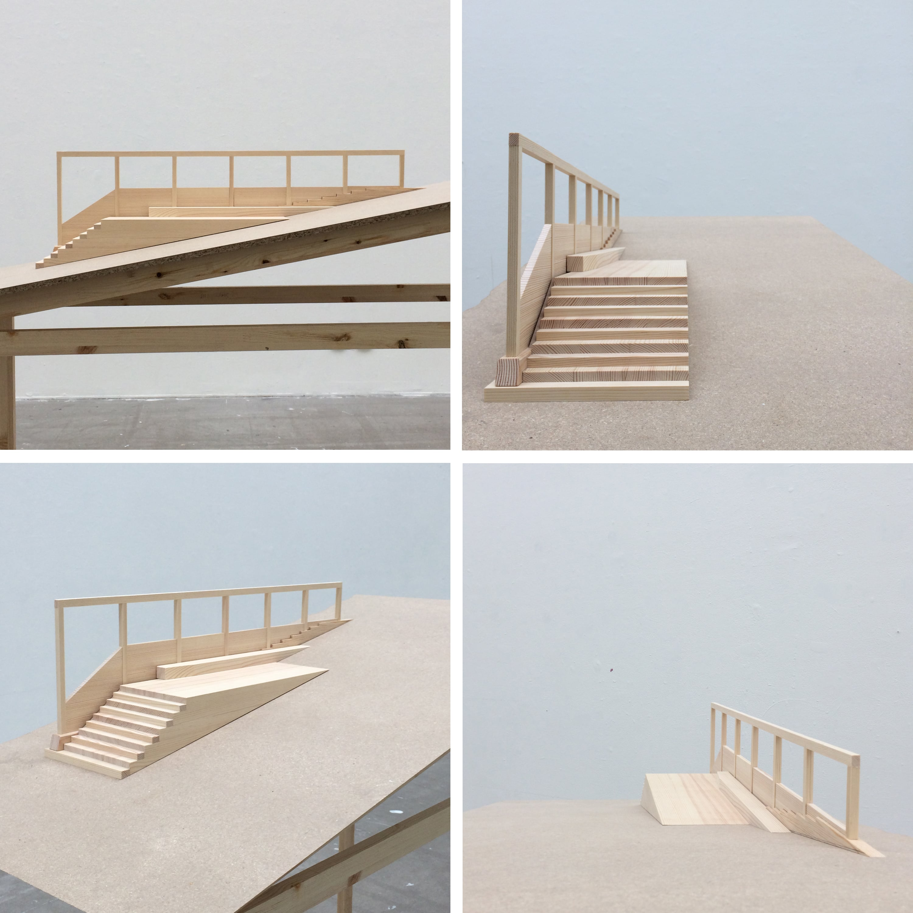

The Romantic Zone is located at the tip of one of Stockholm’s “Green wedges”, Tyrestakilen, where the Nacka nature reserve meets the city. Here, urban ideas of rural culture, nature and heritage are enacted in behaviours that point at one of the main contradictions of this time and place: a consumption of resources that are extracted elsewhere, out of sight, while local nature remains pristine and perfect. A building supply store neighboring a protected forest keeps the dream alive, as do Hammarbybacken's artificial alps. Perhaps the most efficient rural experience can be had here, hiking the forest or running up the hill after work, to reproduce your physical and mental strength to work. 

This project aims to design and inaugurate an annual trail race as a way to collect a landscape that is rarely read together. In architectural terms a race is a spatial sequence of movement and rest in relation to materiality, rhythm, views and so on.

