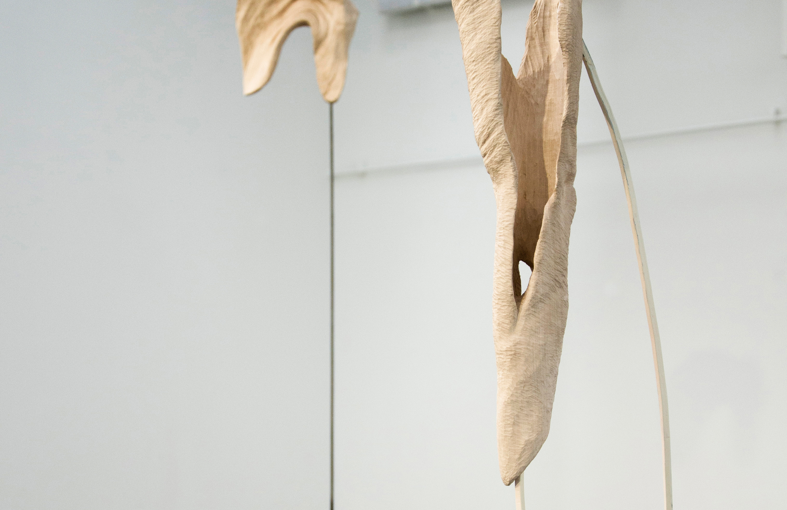
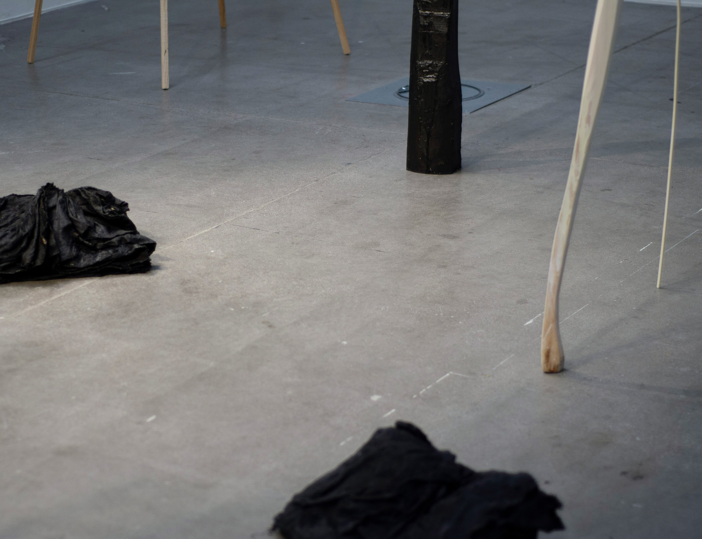
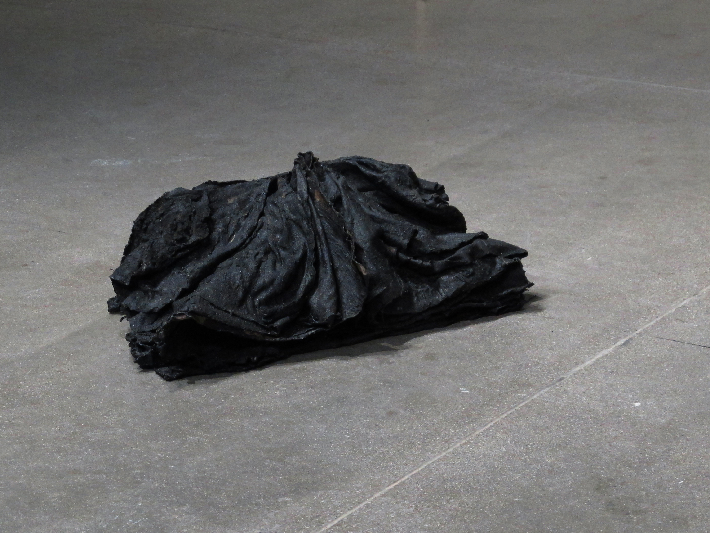
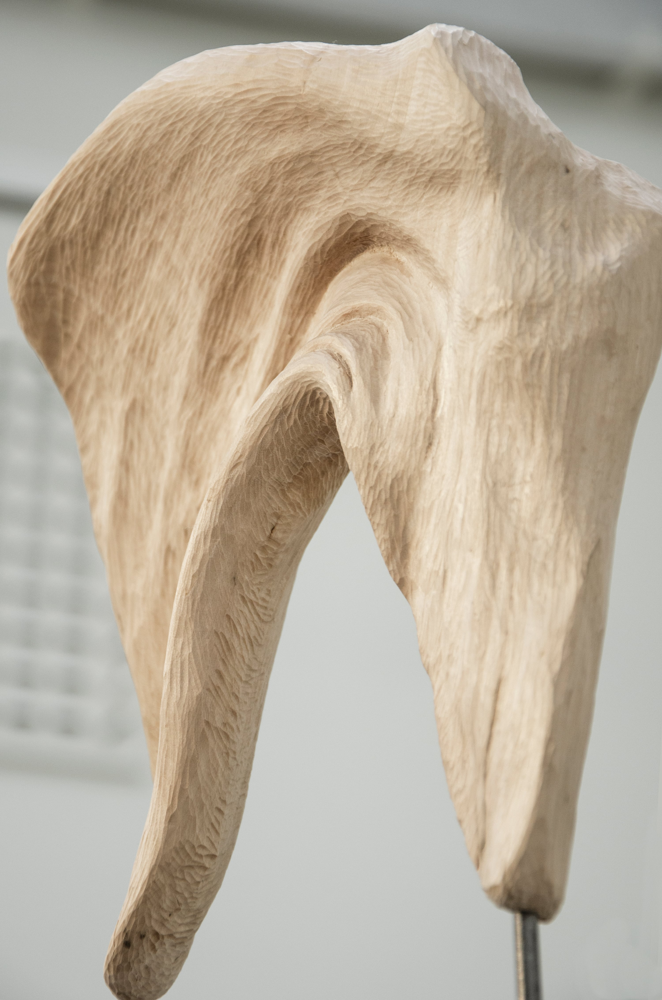
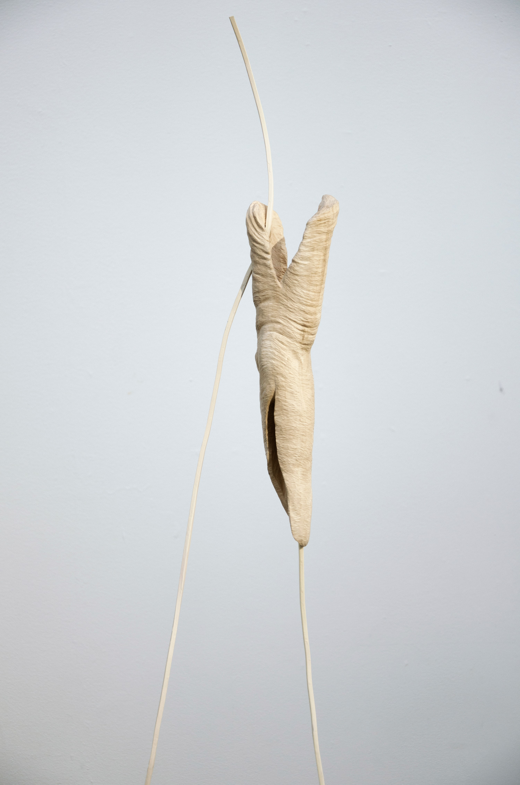
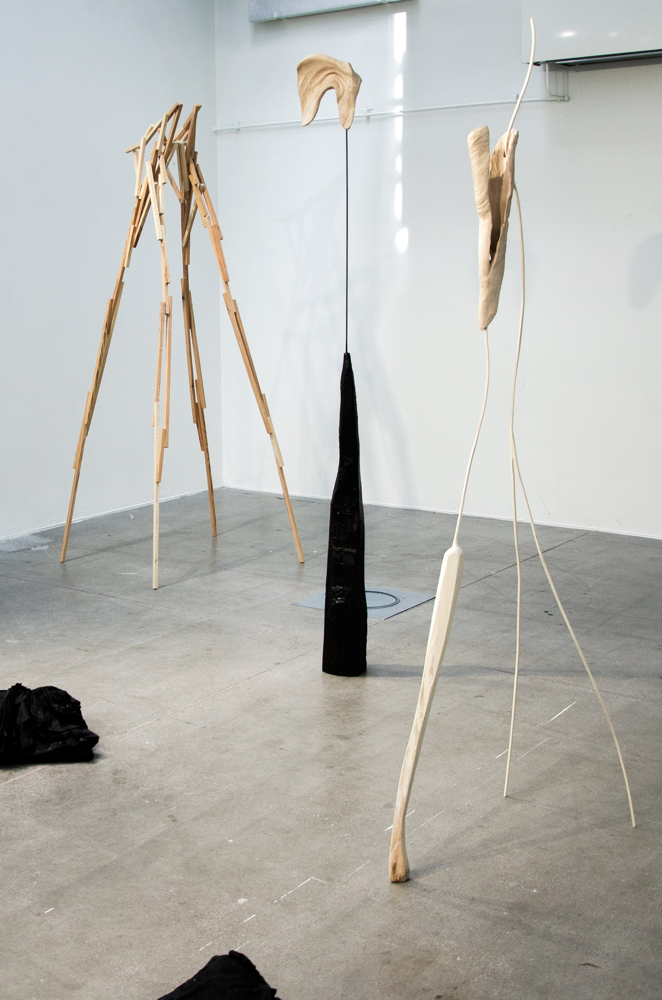

The human body can be seen as something that isn’t yet fully explored, a cognitive, biological and material container of the unknown. It can stand opposed to the tool that have an intentional design and purpose with a deliberate and fully known composition, to fill our needs. 

But the boundary between the body and the technology have never been clear. Tools instead grow out from us as our extensions, as external organs that have evolved along with our bodies and behavior. They create substitutes for and merge with us. They are part of the unknown too.

I see the built environment and tools of today likewise as something not yet fully explored. They are both a part of me and my body - but at the same time something obscure or even alien-like. They create an ambiguous contradiction, something uncanny - their presence evokes a reversed phantom ”pain”.

My work proposes speculations on past, current or future traces of the relation between the body and the environment. Tools and buildings act as a mediator that relates our body to the outside atmosphere and ground - or perhaps distancing ourselves from it. A filler, adhesive, membrane or crumple zone.

