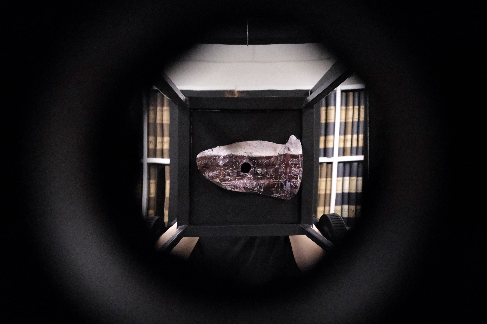
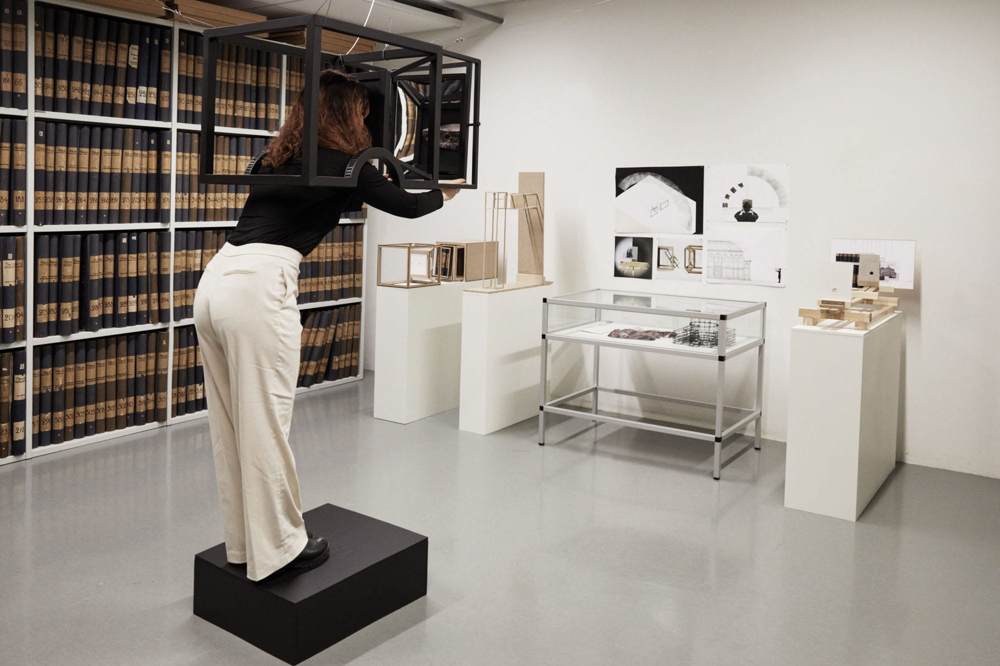

A piece of Space recognizes photographic space as a visualized form of spatial experience and tries to read unspecified spatial information in photos shared in Social Networks Sites (SNS). It explores how photography, which is a framing activity, has affected spatial experience and cognition. I try to re-build a space with photographs and compare the different characters of original space and photographic space by juxtaposition. The combination of original space and photographic space makes designer understand people’s experiential space with a visualized material over spatial hierarchy.  

The project shows three-dimensional space made with photos using a photogrammetry method. It places original space and photographic space within a tool that mechanized the principle of Filippo Brunelleschi’s linear perspective. It highlights the multiple identities of space and visual form of photographic space. Also, by applying Henri Lefebvre’s theory to two different spaces and spatial practices, it gives a clue how designer can understand a photograph as a social product of spatial identity, an independent element from real space.

A piece of space is an experiment spatial tool that draws people into multiple experienced spaces. It is tightly connected with spatial contexts; original space, photographic space and spatial practice by people. The whole process in the project consists of experiments that can explore the meaning of photographic space and how it can be positioned in reality.

‘When you enter a library, you can see the library surrounded by a lot of books. It is a real space. And there is something; the black mechanism tool is floating in the space. You wonder what this is. You hover around the installation and get into the machine. There is a hole that you can see. You follow the line and take your eyes close to the hole. The mirror reflects a space which is blended the photographic space and original space. You are watching the mirror with controlling, and you are in the new space framed by the mirror. What are you looking at? Where are you? Is it space or not?’  

   Photo: Juyeon Baek")

