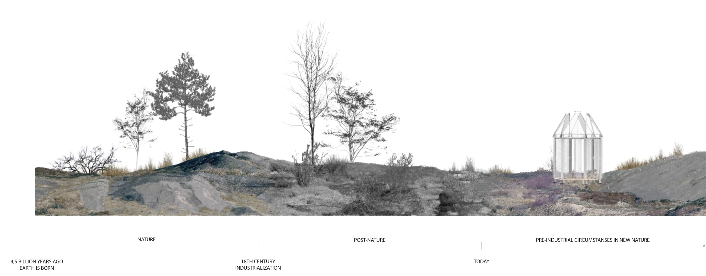

Mitt examensarbete i rumslig gestaltning utgår ifrån naturen och den förändring den genomgått sedan industrialiseringen. Jag jämför synen på naturen idag med den vi hade för omkring 300 år sedan. Arbetet hanterar den roll människan har i förhållande till naturen och hur den tydligare måste definieras för att relationen ska bli gynnsam och hållbar. Natur per definition finns inte idag, vi lever nu i en post-natur värld där vi påverkar naturens samtliga system och processer. En serie interventioner hanterar naturen utifrån olika angreppshåll och ställer frågan vad som är natur och inte.

Strukturen jag byggt fungerar som ett filter som tar bort de tillägg i väderförhållanden vi har idag i relation till pre-industrialiseringen. Den är dels en illustration över klimatförändringen samt en tidskapsel av ”riktig” natur.

–

My thesis project in spatial design explores nature and the change it´s been going through since the industrialization. I´m comparing the view on nature we have today with the one we had around 300 years ago. The work deals with the role humans have towards nature and how that needs to become clearly defined for the relationship to be favorable and sustainable. Nature does not exist today; we now live in a post-nature world were our impact affects all-natural processes and systems. I have made a series of interventions dealing with nature from different aspects and ask the question: what is nature and what is not? 

The structure I´ve built works as a filter which takes away the surplus of weather conditions we have today in relation to pre-industrial time. It´s both an illustration of climate change and a time capsule of “true” nature.

