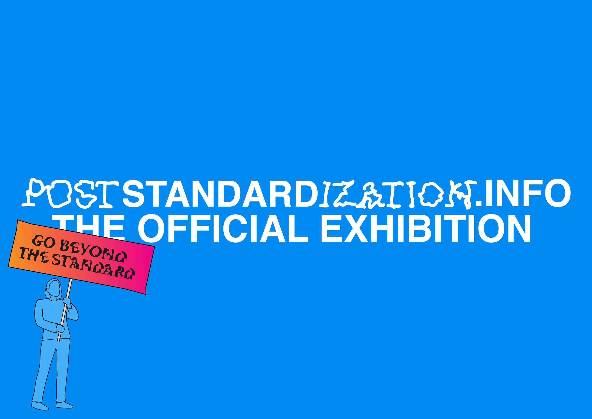
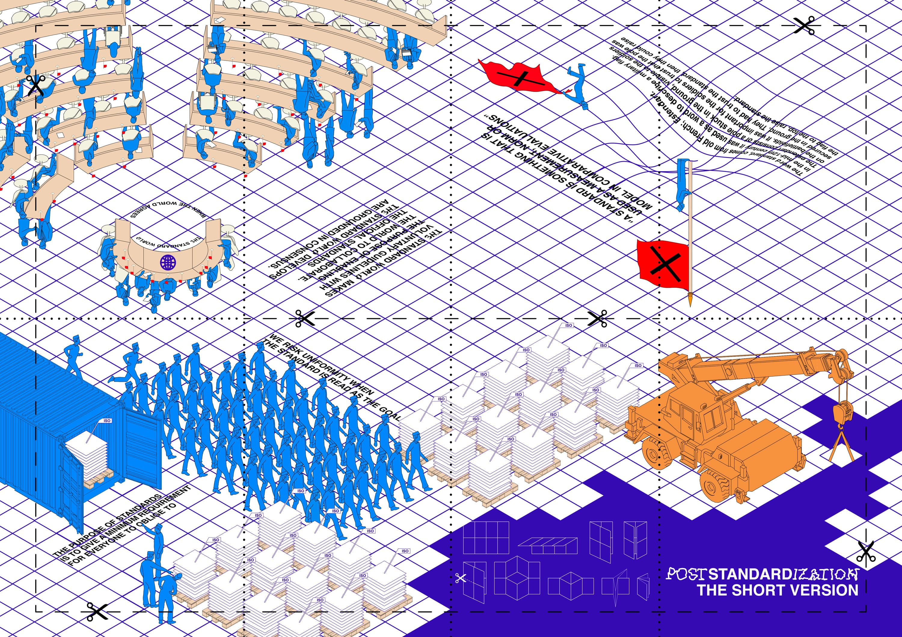
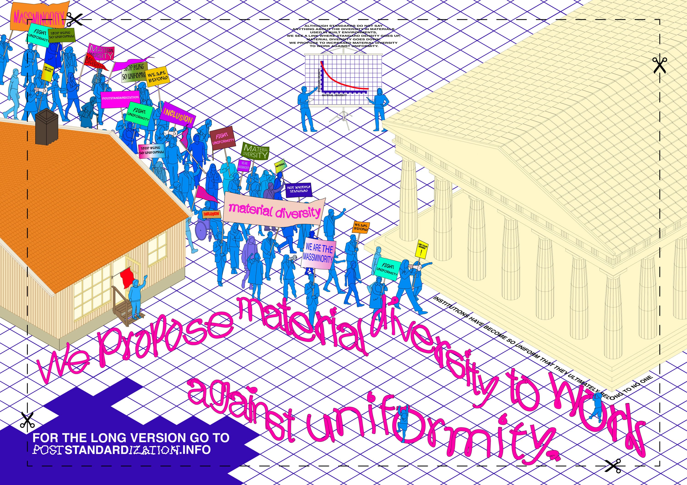

In order to contribute to equality, we must go beyond the standard, and build up our ability to see through several perspectives. It isn’t only about giving access, it’s about making design that supports people in being contributing stakeholders. It’s necessary for some, but good for us all.
 
I want to learn from people with disabilities and the spatial border they are faced with, by exploring the responsibility I have been given, through claiming a role that affects our built environments. Understanding the possibility that my design can discriminate. I have experience with disabilities and handicaps, but these experiences do not automatically make me better in addressing issues concerning other people with disabilities. I must learn to combine my experiences with my new role as an interior architect. I am dyslexic and have been through big obstacles, particularly in the educational system, and I have my Aunt, who has an intellectual disability. I am privileged to have these experiences, and with this thesis I have explored them as an interior architect. This is where I start on my way to contribute.

Through my experiences with disabilities, I know the need for explanations is an issue that often comes up. The first design challenge I took on was an attempt to explain the complexity and diversity to a disability. I chose to use my Aunt as an example because I am confident in my ability to describe her. An attempt to “explain her”, a mission that might be interpreted as weird and undignified. On the other hand, I have had to do this all my life. If I talk about her I almost forget that my story doesn’t make sense if they don’t know her, if they don’t know how she is. To explain is uncomfortable, not because I talk about a person who is different, but because people often have very little knowledge and understanding about what different means.

With the pandemic came restrictions to interact in physical space.  The traditional exhibition was put aside and we therefore decided to join what we consider to be the greatest exhibition of all the internet.  Visit the official exhibition at POSTSTANDARDIZATION.INFO 

