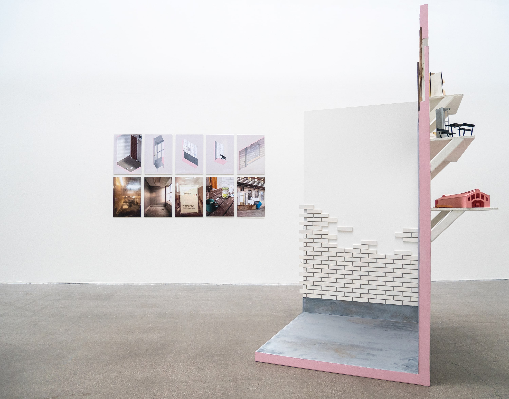
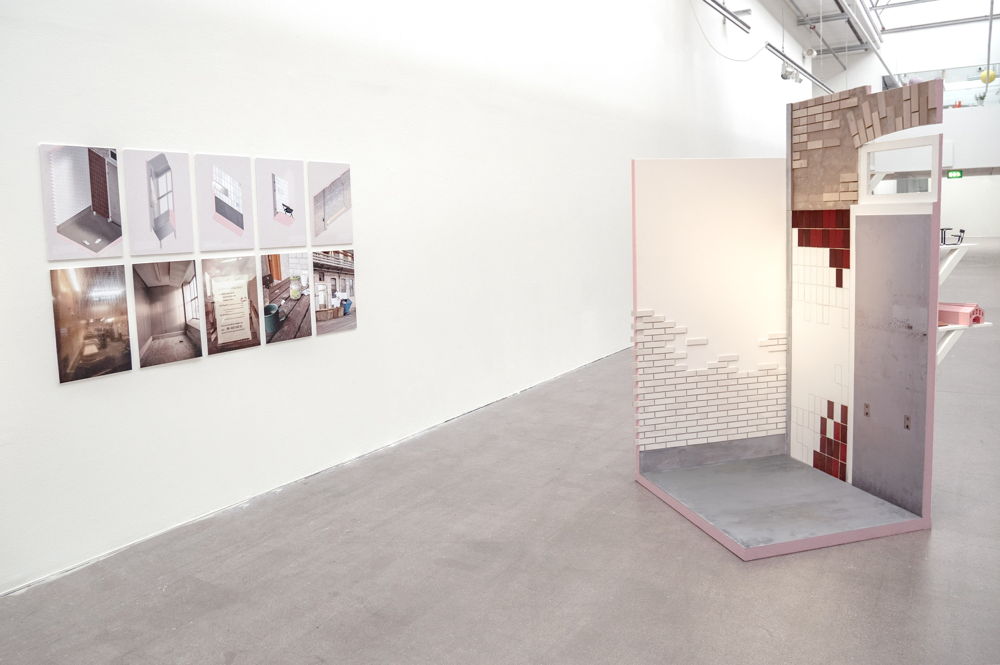
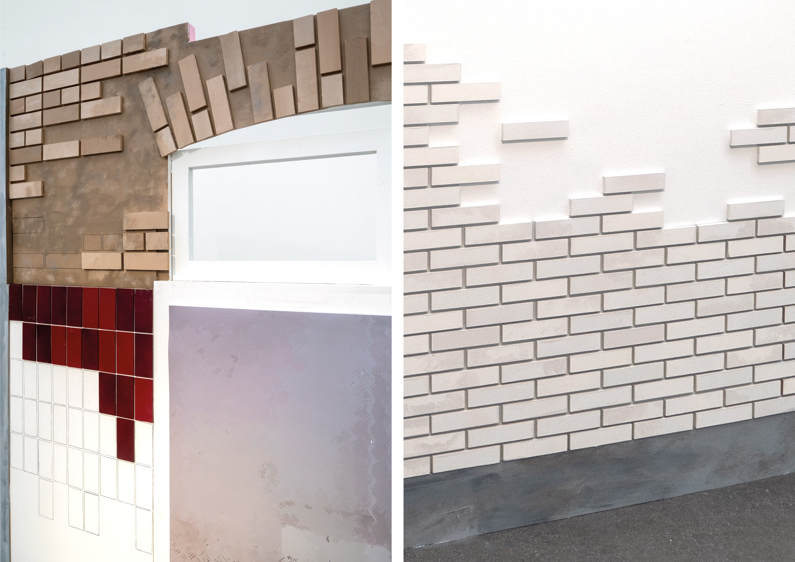
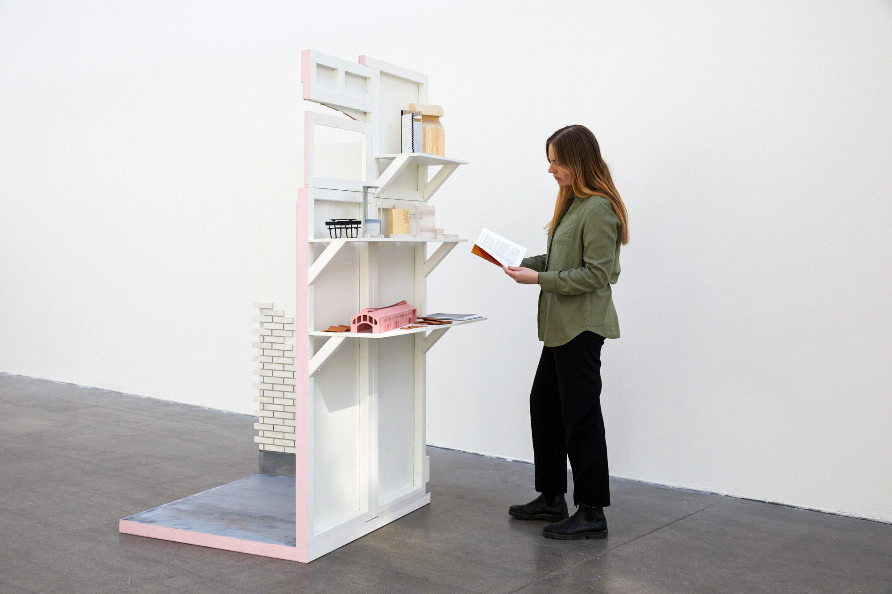
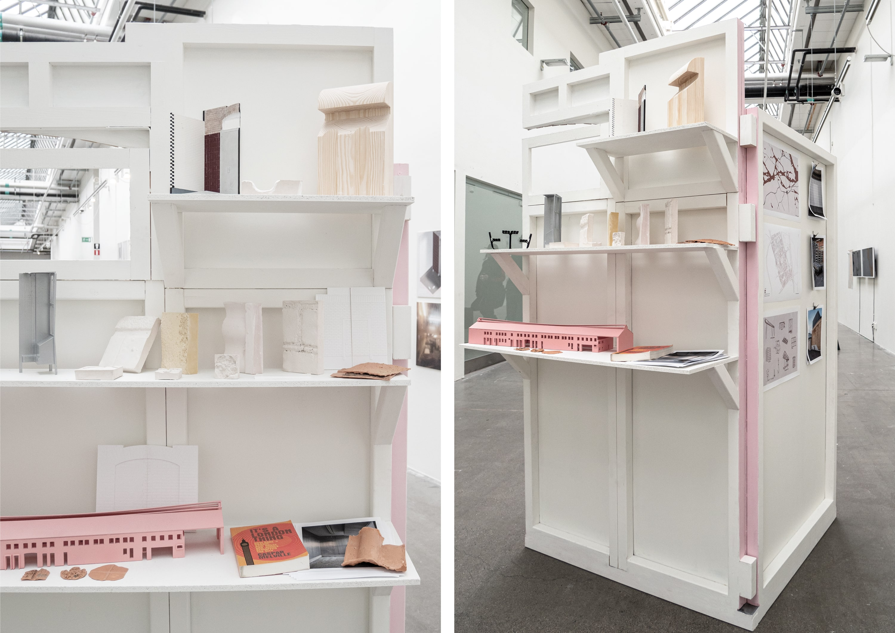
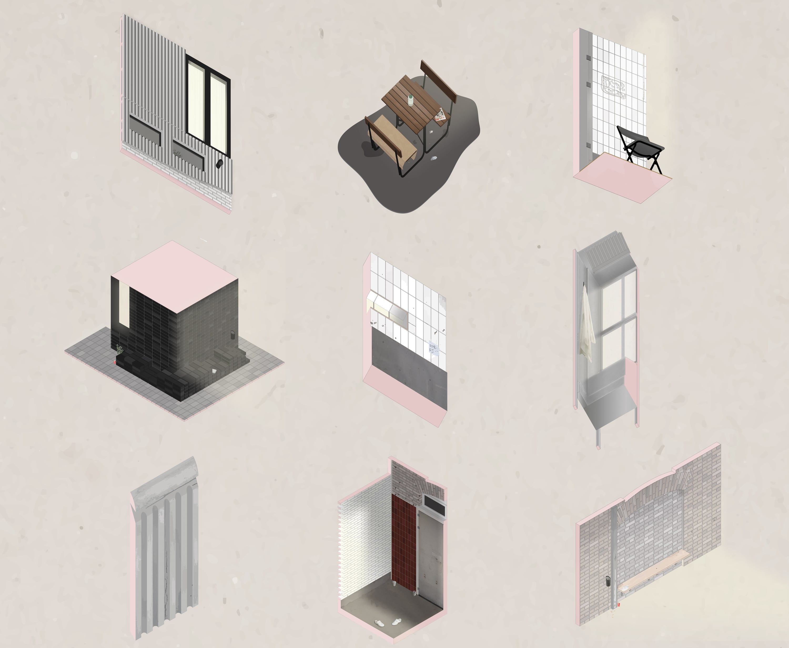
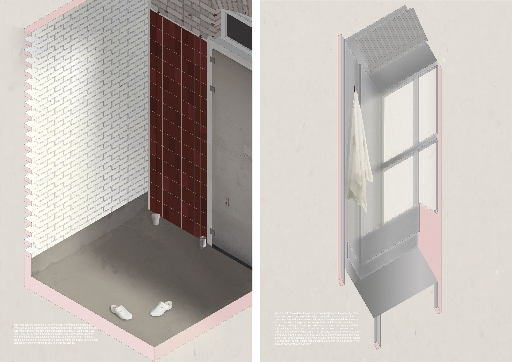
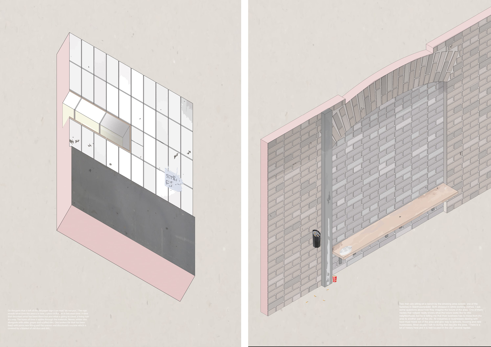

The population of Stockholm is expected to increase with over 300 000 people during the next ten years according to Region Stockholm. As the number of inhabitants grow, the city needs to expand. Many of Stockholm’s industrial areas already have or are planning to be demolished or reconstructed into residential areas. The meatpacking district of Stockholm, called Slakthusområdet is no exception. By 2030, the transformation of the area to become the next "event and entertainment hub” should be completed. During this transformation, a lot of both history and architecture will get lost. 

In my degree project which is called meetings through transformation I have studied the existing landscape of Slakthusområdet. Through the use of different mapping techniques, I am dissecting and fragmenting the site and revealing its many layers of time and stories. I want to preserve a part of history by highlighting the spatial qualities and social structures I found on site, so called meetings. The collected fragmented data of Slakthusområdet are then transformed into models, castings, photographs and drawings containing stories from the people I have met as well as traces of humans and time. My intention with the work is to learn from a type of industrial architecture that is disappearing in our society but also to address and comment on the urban planning of Stockholm today. I believe there is a value in investigating and learning from what already exists and make additions instead of demolishing large areas of development to make room for new. If the urban planning allowed some parts of the city to grow successively, by adding new layers of architecture onto the old ones like a layered cake, I believe we would have more versatile areas where different scales, expressions and social structures meet and therefore a more welcome and vibrant city.

–

Befolkningen i Stockholm förväntas öka med över 300 000 människor under de kommande tio åren enligt Region Stockholm. Allt eftersom invånarantalet stiger, måste staden utvidgas. Många av Stockholms industriområden har redan eller planerar att, rivas eller rekonstrueras till nya områden. Slakthusområdet i Stockholm är inget undantag. År 2030 förväntas omvandlingen av området till att bli stadens stora ”evenemangs- och underhållnings centrum" vara klar. Mycket av både historia och en viss typ av industriell arkitektur kommer att gå förlorad vid en omprogrammering och rekonstruktion av området.

I mitt examensarbete ”Meetings through transformation” studerar jag det befintliga landskapet i Slakthusområdet. Genom att använda olika kartläggningstekniker fragmenterar och undersöker jag dess många lager av tid och berättelser. Jag vill bevara en del av historien genom att lyfta fram de rumsliga kvaliteterna och de sociala strukturerna som jag hittar på platsen, så kallade möten. Den insamlade informationen omvandlas sedan till modeller, gjutningar, fotografier och ritningar som innehåller berättelser från personer som jag har träffat samt spår av människor och tid. Min avsikt med arbetet är att lära mig av en typ av industriell arkitektur som försvinner i vårt samhälle men också att kommentera på Stockholms stadsplanering i dag. Jag anser att det finns ett värde i att granska och lära av de redan existerande byggda miljöerna och att göra tillägg istället för att riva stora områden för att skapa plats för nytt. Om stadsplaneringen tillät vissa delar av staden att växa organiskt, genom att lägga till nya lager av arkitektur på de gamla, tror jag att vi skulle ha fler mångsidiga områden där olika skalor, uttryck och sociala strukturer möts och därför en mer välkomnande och levande stad.

